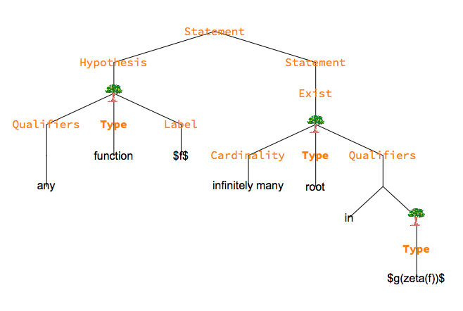

# Semantic Math Project

The semantic math project consists of two components: *semantic math parser*, which converts mathematical statements into parse trees; and *theorem search*, which is a retrieval system for key statements from the arXiv corpus.

# Semantic Math Parser

The math parser creates a semantic parse tree from a math statement. It is a bottom-up parser, and uses context-free grammars. The parser produces competing parses, with scores used for ranking. It uses a lexicon, but can also infer token type from surrounding tokens for out-of-vocab words.

## Examples

The parser first tokenizes the input, then creates the parse tree from the resulting tokens. To run the parser, one can use the function

```java
parseInput(String str, ParseState parseState, boolean isVerbose)
```
within `thmp.parse.ParseInput`.

An example of the parse tree is



for the statement "Given any function $f$, there are infinitely many roots in $g(zeta(f))$".

# Theorem Search

The theorem search component includes both data processing and runtime retrieval.

## Data processing
To ensure that the search has fast runtime, the arXiv papers are pre-processed to extract and annotate the key statements in each paper. All key statements from the corpus are extracted, including theorems, propositions, definitions, etc. These statements are then annotated, which includes indexing terms, finding contextual information for variables in each statement, etc. The data are also uniformized, for instance by word-stemming and singularization.

To run the data processing code, one needs to have the requisite arXiv data tar files, named similarly to arXiv_src_0001_001.tar if downloaded from the arXiv bulk access program. The data processor takes as input a metadata file containing newline-separated paths to these tar files. This file will be referred to as metaDataFile.txt below.

Two scripts are run for the two stages of data processing, which are deliberately kept indepedent:

1) Extracts each tar file, and produces a set of serialized data and metadata files.

To run the first processing stage, run the processing script `./generateSearchDataRunner.sh path/to/metaDataFile.txt `. 

2) Takes the results of the first stage for all tar files, and combine them into a sequence of contiguous data, ensuring contiguous theorem indexing.

To run the second processing stage, run the processing script `./combineMatrix.sh path/to/metaDataFile.txt `. 

Note that these two stages are kept independent, as the second stage may combine data processed under different runs of the first stage.

The resulting data files can then be deployed to a database and serialized into a web archive file to be used for the search.

## Examples
Theorem search employs several algorithms:

1) Words-based search: term membership in theorems are precomputed, each term retrieves a list of theorems, take ranked intersection of these lists.
2) Semantics-based search: precompute parse of the theorems to create context vectors that record parent-child relations, and creates ranking based on the number of coinciding relations.
3) Latent semantic analysis: which uses truncated SVD to find semantically similar statements.

Each search algorithm can be invoked separately, or altogether. A run the combined search, one can use the function 
```java searchCombined(String input, Set<String> searchWordsSet, boolean searchContextBool)``` 

within `thmp.search.SearchCombined`.

# Build 
To build the project, run the ant script with the default target: `ant run`.


